## Impact of TCP's Initial Congestion Window

Jörg Thalheim
<joerg.thalheim@tu-dresden.de>

Note:
Hi I am Jörg Thalheim and I will present you today,
which findings I had while evaluating TCP's Initial Congestion
Window under different network conditions.
I will structure this talk in the following way:

### Structure

1. Task
2. Motivation
3. Measurement Setup
4. Result
5. Conclusion

Note:
- After I explained the task,
- I will give a short recap, how TCP Congestion Control works in general
- and which role the initial TCP congestion window plays in this context.
- After that I will present the test setup I have chosen
- and what throughput I have measured in this simulation.
- Finally I will conclude, what I learned
- and how applicative this findings are for bigger dynamic systems.

### Task

- Current TCP standard limit a TCP flow of at most three segments or about 4 KB
  of data (RFC3390)
- Experimental standard RFC6928 propose an increase 10 segments
- Task: Investigate the impact of initial congestion window size on throughput of short lived
  transaction

Note:
- The current RFC from 2002 suggestion for TCP suggest a congestion window of about 4KB of user data.
- However large-scale experiments by Google have shown that an increase to at
  least 10 segments improve the end-to-end latency without scarifying network stability
- as an result a new RFC was proposed
- My task was to test the throughput of TCP with different initial congestion
  windows under various network conditions.
- But first I will recap how TCP Congestion Control works in general.

### Motivation

- Key to scalability of TCP on global scale: TCP Congestion Algorithm

<a href="tcpcongestion1.jpg" target="_blank">
  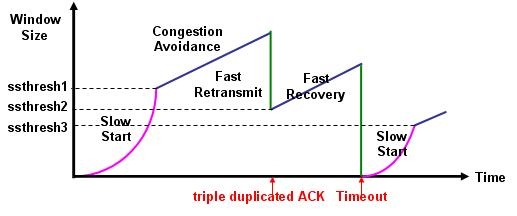
</a>
<small> Source: http://androidmodguide.blogspot.de/p/tcp-algorithms.html </small>

Note:
- TCP Congestion Control mechanism are important to scale TCP/IP in the internet
- It allows to adapt the TCP window to the current network condition without
  overloading it
- Part of these algorithms is Slow Start
- It limits the number of bytes TCP will send before waiting for an
  acknowledgement
- on every acknowledged packet it will increase congestion windows size by one
  segment until either package loss is detected or the segment size threshold is
  reached.
- in case of package loss, which could be indicated by receiving a duplicate
  Acknowledgement 3 times, TCP will trigger a Fast Retransmit
- if the segment size threshold is reached TCP will perform Congestion Avoidance
  algorithm
- instead of exponential grows the window will increase additive

### Motivation

- HTTP-Download: 10Mbit/s, 10ms RTT, 16MiB File

<a href="congestion-algos.png" target="_blank">
  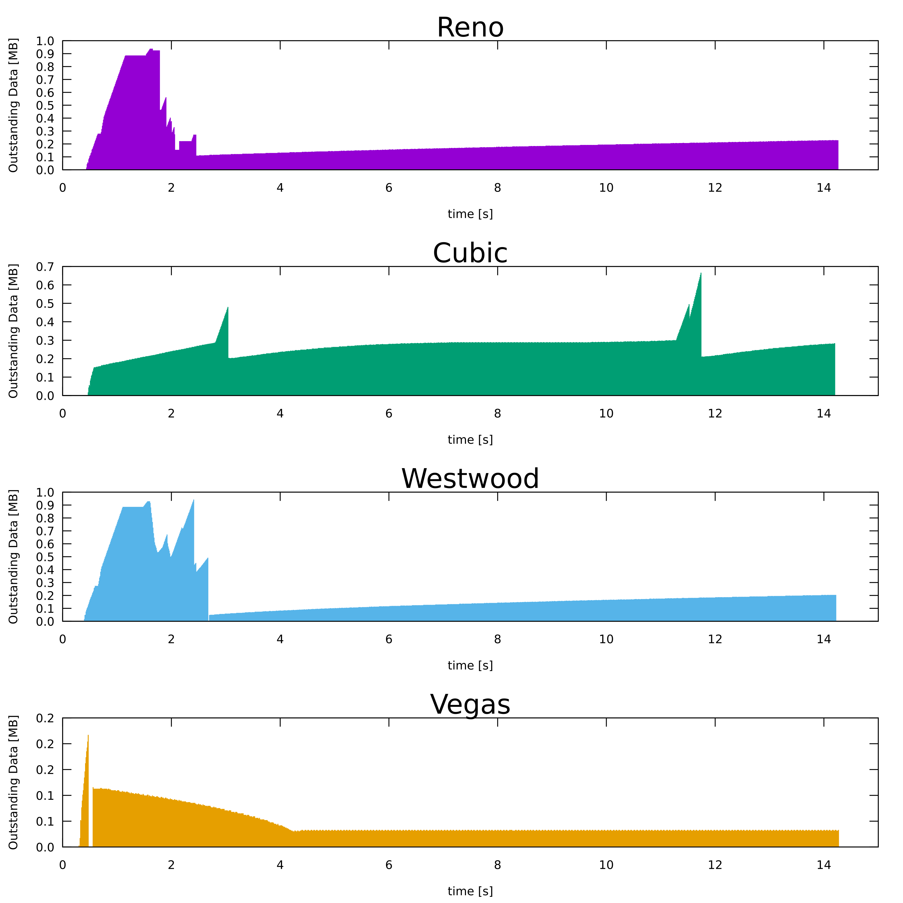
</a>

Note:
- In practice there several TCP congestion algorithms with different emphasis
- In this graph from wireshark, we see a single HTTP download over a 10Mbit link
  using different TCP congestion avoidance algorithm.
- Reno:
  - a classical TCP congestion algorithm, half the window on reset
- Cubic:
  - Current standard in Linux, less aggressive and optimized for long pipes
- Westwood:
  - newer version of Reno, very efficient
- Vegas:
  - Focus on wireless networks and network delay
  - tries to detect early congestion based on RTT
- what they have in common is the TCP slow start part at the benign of a
  connection
- Google claims that most web response sizes already finishes within the TCP
  slow start.
- So that TCP cannot build up the full possible window and use all the available
  bandwidth

### Motivation

The Top 100 popular websites according to http://httparchive.org/ from Jan. 2016
<a href="average_response_size.jpg" target="_blank">
  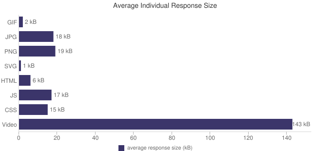
</a>

Note:
- we see that a lot the web objects are below 20kb, which is less then the
  average what have seen as a stable TCP congestion window for 10mbit/s link
  with a rather lower Round Trip time
- on modern internet 100mbit is not uncommon any more and also the round trip
  time is usually higher.

### Motivation

- Browsers vendors approach: <a target="_blank" href="https://www.browserscope.org/?category=network">Parallel Requests</a>
- "Elephant Flow": long and continuous TCP flows

Note:
- to speed up TCP anyway a technique used by browser vendors,
- is to open multiple TCP connections at once
- and request resources in parallel
- However this has the disadvantage,
- that now multiple connection compete for the same bandwidth
- and we the overhead of TCP and TCP slow start adds up
- a second problem are the so called Elephant Flow
- these are long and continuous TCP flows,
- they get an unfair amount of the available bandwidth compared to short Requests,
  because their congestion window has grown to the maximum

## Motivation

- Solution? Increase the initial window size!

<a href="throughput.png" target="_blank">
  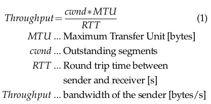
</a>
<small>
  <a href="http://opac.inria.fr/record=b1120676">Source: Emerging directions in embedded and ubiquitous computing</a>
</small>

Note:
- If we look at the math,
- we get the throughput of TCP by multiplying the congestion window size by the
  MTU divided by the round trip time
- under the assumption that no segment get lost during this round trip

## Motivation

- Solution? Increase the initial window size!

<a href="transmission-time.png" target="_blank">
  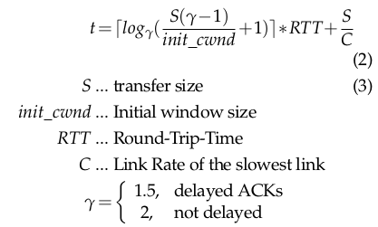
</a>
<small>
  <a href="http://ieeexplore.ieee.org/xpl/mostRecentIssue.jsp?punumber=6725">Source: INFOCOM 2000. Nineteenth Annual Joint Conference of the IEEE Computer and Communications Societies. Proceedings. IEEE</a>
</small>

Note:
- If we take the initial window size as input size
  and transfer a file of the size S,
  we get the following equation for the overall transfer time.
- in this equation, we see that in theory if we increase the initial window
  size, we get a smaller transfer time
- To test this this assumption I choose the following setup

### Measurement Setup

- network model:
<a href="measurement-setup.png" target="_blank">
  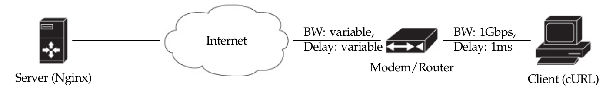
</a>
- Simulated network by mininet: https://github.com/Mic92/acto15-tcpicw

<a href="mininet.png" target="_blank">
  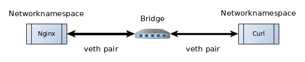
</a>

Note:
- The evaluation was done by using Mininet
- This is a network virtualisation framework
- It allows processes to run separate networks in arbitrary topologies
- Because of missing data/resources, I was choosing a rather simple setup:
  - the assumption I made by this model is, that the uplink, which connects
    a client to the internet is almost always the bottleneck
  - I created with mininet 2 network namespaces, which are connected over a
    software bridge
  - In one container I was running curl, which act as my HTTP client
  - In the other namespace the web server Nginx was running, serving static
    files

### Measurement Setup

|            size                |                      values                                        |
| ------------------------------ | ------------------------------------------------------------------ |
| initial window size [segments] |  3, 4, 5, 6, 7, 8, 9, 10, 12, 14, 18, 24, 32, 40                   |
| uplink forwarding delay [ms]   |  1, 5, 10, 50, 100, 300                                            |
| uplink bandwidth [mbit/s]       |  1, 2, 5, 10, 100                                                  |
| requests size [kb]             |  1, 2, 4, 16, 32, 64, 128, 256, 512, 1024, 2048, 4096, 8192, 16384 |

Note:
- I made multiple measurements with various parameter:
  - set the initial window size using the route attribute `initcwnd`
  - limit the forwarding delay and bandwidth with traffic control
  - and use different files sizes for HTTP

###  Result

- All Graphs: https://mic92.github.io/acto15-tcpicw/

Note:
- On the linked website I have uploaded all graphs
- in the following, will show some representative graphs

###  Result

For 1mb/s:
<a href="bandwidth-1mb.png" target="_blank">
  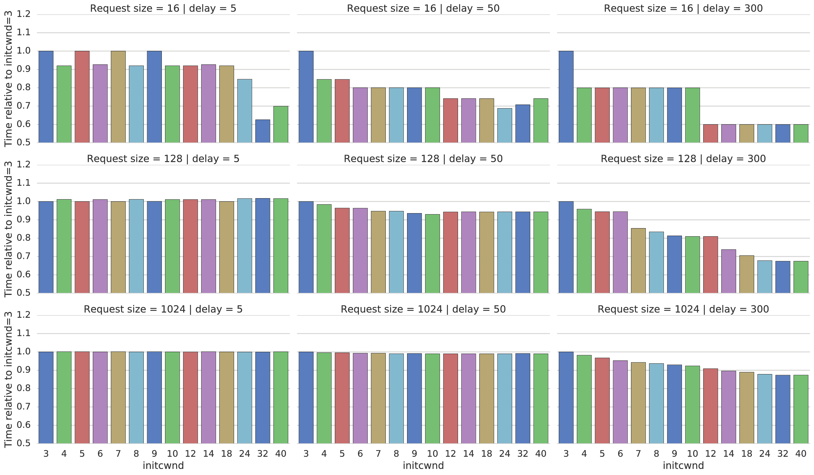
</a>

Note:
- on X-Axis: are the initial Window sizes depicted
- on Y-Axis: we see the Transfer-Time relative to an initial window of 3
- from up to down: the request size increase
- left to right: the delay increases
- we see bigger gains if the latency gets higher
- this is because we save more RTTs on this network
- the gain decreases with bigger file sizes
- this is because the TCP window can fully build up with bigger file sizes
- the gain ranges from no improvement to 60%
- for higher bandwith we also see bigger speed ups for bigger file sizes

###  Result

For 10mb/s:
<a href="bandwidth-10mb.png" target="_blank">
  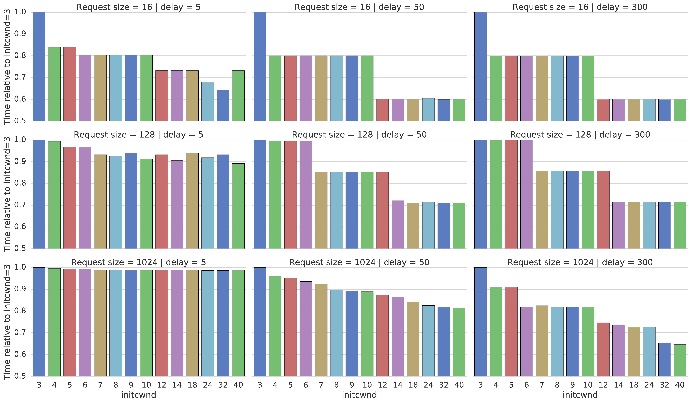
</a>

###  Result

For 100mb/s:
<a href="bandwidth-100mb.png" target="_blank">
  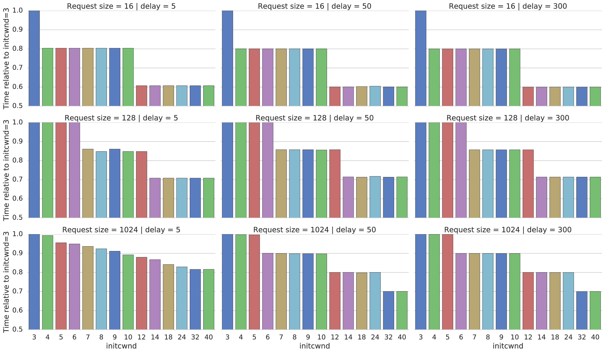
</a>

###  Conclusion

- the bigger the Bandwith-Delay-Product gets, the more gain from bigger initial
  congestion windows sizes can be expected (even beyond a window size of 10)
- However:
  - test setup was pretty simple
  - High initcwnd might hurt network stability

###  Conclusion
- [Linux](https://git.kernel.org/cgit/linux/kernel/git/torvalds/linux.git/commit/?id=442b9635c) already uses a initcwnd of 10 by default
- also most CDNs

<a href="initcwnd-cdns-20140828.png" target="_blank">
  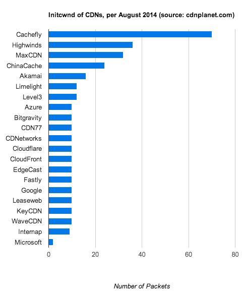
</a>
<small>Source: http://www.cdnplanet.com/blog/initcwnd-settings-major-cdn-providers/</small>

# Question?
